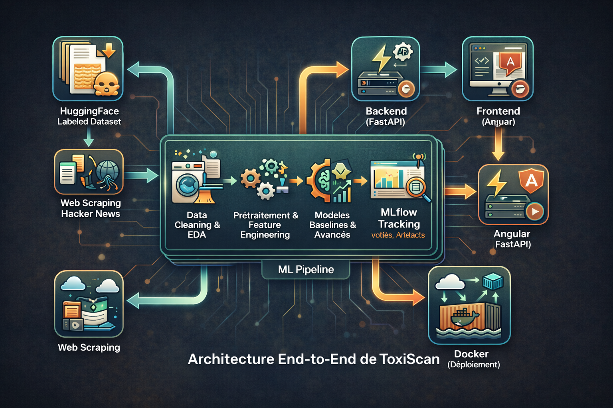
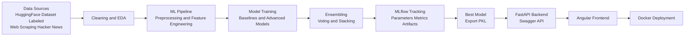

# ToxiScan — Plateforme End-to-End de Détection de Contenus Toxiques 

**Module :** Python for Data Science 2 (Guided Machine Learning Project)  
**Encadrant :** Haythem Ghazouani  
**Année universitaire :** 2025–2026  
**Durée du projet :** 7 semaines  

---

##  Équipe (Groupe de 4)

- **Nour BEN HASSINE** — Acquisition des données (dataset + web scraping) & EDA  
- **Nouha BEN KHELIL** — Prétraitement des données textuelles & Feature Engineering  
- **Hadir FELLI** — Modélisation, comparaison des modèles, ensembling & MLflow  
- **Nouha BRIKI** — Backend FastAPI, Frontend Angular & Docker  

 **Mail de groupe :** nhningjg@gmail.com  

---

##  Contexte & Problématique

Avec l’essor des plateformes numériques, les contenus toxiques (insultes, propos haineux, menaces, abus verbaux) sont devenus un problème majeur.
La modération manuelle est coûteuse, lente et difficile à généraliser.

**ToxiScan** a pour objectif de concevoir une **solution intelligente et automatisée** capable de détecter la toxicité dans des contenus textuels réels, en s’appuyant sur des techniques de **Machine Learning appliquées aux données textuelles**, tout en respectant une approche **end-to-end** et **MLOps**.

---

##  Objectifs du projet

L’objectif principal est de construire un **projet complet de bout en bout**, de la donnée brute jusqu’au déploiement.

Les objectifs spécifiques sont :

1. Sélectionner et exploiter un **dataset textuel réel et volumineux** (non Kaggle).
2. Collecter des données supplémentaires via **web scraping** pour se rapprocher de conditions réelles.
3. Réaliser une **analyse exploratoire des données (EDA)**.
4. Mettre en place un **pipeline de prétraitement des données textuelles**.
5. Entraîner et comparer **plusieurs modèles de Machine Learning**.
6. Appliquer des **méthodes ensemblistes** pour améliorer les performances.
7. Assurer la **traçabilité des expériences** avec **MLflow**.
8. Exporter le **meilleur modèle** sous forme de fichier `.pkl`.
9. Déployer le modèle via une **API FastAPI** (avec Swagger).
10. Développer une **interface frontend Angular** pour tester et visualiser les prédictions.
11. Containeriser l’application avec **Docker / docker-compose**.
12. (Optionnel) Mettre en place une automatisation via **GitHub Actions**.

---

##  Dataset principal (Source officielle)

- **Nom du dataset :** Jigsaw Toxic Comment Classification  
- **Source :** Hugging Face Datasets  
- **Lien :**  
  https://huggingface.co/datasets/thesofakillers/jigsaw-toxic-comment-classification-challenge  

### Description
Ce dataset contient des **commentaires textuels réels** accompagnés de labels indiquant différents types de toxicité (toxic, insult, threat, etc.).

### Pourquoi ce dataset ?
- Données **textuelles réelles**
- **Volume important** (~466 000 lignes)
- Problème industriel réel (modération de contenu)
- Parfaitement adapté à :
  - la comparaison de modèles
  - l’ensembling
  - le tracking MLflow

---

## Web Scraping (Complément de données réelles)

En complément du dataset labellisé (Hugging Face – Jigsaw Toxic Comment Classification),
nous avons mis en place deux méthodes de collecte automatisée de données afin
d’obtenir des commentaires réels non labellisés et tester la robustesse du modèle
dans des conditions proches du monde réel.

---

###  Scraping via API Publique — Hacker News

- Source : https://news.ycombinator.com
- Méthode : API officielle Firebase Hacker News
- Format : JSON structuré

#### Implémentation
Le script `hn_api_collect.py` :

- Récupère les IDs des items
- Filtre les commentaires (`type == comment`)
- Extrait les champs :
  - id
  - by
  - time
  - parent
  - text
- Sauvegarde dans : data/raw_scraped/hn_comments_raw.csv

#### Objectif

- Collecte massive (plusieurs milliers de commentaires)
- Données structurées
- Tests de robustesse du modèle
- Simulation d’inférence en production

---

###  Scraping HTML — Parsing du DOM

- Source : pages HTML `item?id=XXXX`
- Méthode : `requests` + `BeautifulSoup`
- Extraction des balises `span.commtext`

#### Implémentation
Le script `hn_html_scrape.py` :

1. Récupère les IDs des threads depuis la page d’accueil
2. Accède aux pages de discussion
3. Parse le HTML
4. Extrait les commentaires
5. Nettoie le texte (regex + normalisation)
6. Sauvegarde dans : data/raw_scraped/hn_comments_html.csv

#### Pourquoi faire du scraping HTML ?

- Comprendre la structure DOM d’un site réel
- Manipuler des données non structurées
- Gérer rate limiting et parsing
- Simuler un scénario industriel réel

---

### Objectifs globaux du Web Scraping dans ToxiScan

- Collecter plusieurs milliers de commentaires publics
- Tester la robustesse du modèle entraîné
- Réaliser une EDA complémentaire sur données réelles
- Alimenter la démonstration du frontend
- Simuler une utilisation en conditions réelles

---

### Positionnement dans le projet

-  Dataset Hugging Face → Entraînement supervisé + MLflow  
-  Données scrapées (API + HTML) → Tests d’inférence & démonstration

> Le dataset Hugging Face est utilisé pour l'entraînement supervisé,  
> tandis que les données scrapées servent à l’évaluation qualitative
> et à la validation en conditions réelles.

---

### Bonnes pratiques & éthique

- Données publiques uniquement
- Respect du rate limiting
- Aucun contournement de protection
- Usage académique exclusivement

---

## Architecture cible (End-to-End)




---
##  Modélisation & Comparaison (implémentée)

### Modèle baseline

- TF-IDF + OneVsRest(LogisticRegression)
- Gestion du déséquilibre via class_weight="balanced"
- Optimisation des hyperparamètres avec GridSearchCV

Ce modèle s’est révélé le plus performant en F1-score macro.

---

### Modèles avancés testés

- Random Forest (avec réduction de dimension via TruncatedSVD)
- XGBoost (avec TruncatedSVD)

Ces modèles ont été évalués et comparés via MLflow.

---

### Suivi des expériences (MLflow)

Toutes les expérimentations (Baseline, RandomForest, XGBoost) ont été :

- Trackées avec MLflow
- Comparées via F1-macro et F1-weighted
- Loggées avec paramètres et artefacts

Le meilleur modèle sélectionné :

TF-IDF + OneVsRest(LogisticRegression)

Il a été enregistré et exporté pour le déploiement.

---

## Déploiement Backend — FastAPI

Le meilleur modèle entraîné a été exporté au format `.joblib`
et intégré dans une API REST développée avec FastAPI.

### Lancer l’API en local

pip install -r requirements.txt
uvicorn code.app:app --reload
Swagger UI : http://127.0.0.1:8000/docs
Health check : http://127.0.0.1:8000/health

---

### Endpoints disponibles

- GET /health  
  Vérifie si le modèle est correctement chargé.

- POST /predict  
  Prédiction sur un texte unique.
  Retourne :
  - Les 6 labels (0/1)
  - Les probabilités associées

- POST /predict_batch  
  Permet d’uploader un fichier CSV contenant une colonne
  `text` ou `comment_text` pour effectuer des prédictions en batch.

### Swagger UI

Documentation interactive disponible via :

http://localhost:8000/docs

Cela permet de tester l’API sans frontend.

---

### Exemple de réponse API

```json
{
  "text": "you are stupid",
  "predictions": {
    "toxic": 1,
    "severe_toxic": 1,
    "obscene": 1,
    "threat": 0,
    "insult": 1,
    "identity_hate": 1
  },
  "probabilities": {
    "toxic": 0.99,
    "severe_toxic": 0.72,
    "obscene": 0.99,
    "threat": 0.03,
    "insult": 0.99,
    "identity_hate": 0.50
  }
}

---
##  Stack technique

- **Langage :** Python  
- **Data Science :** pandas, numpy, scikit-learn  
- **Données textuelles :** TF-IDF, preprocessing de texte  
- **MLOps :** MLflow    
- **Backend :** FastAPI + Swagger (déployé et testé)
- Suivi des expériences : MLflow (tracking + model registry)
- **Frontend :** Angular  
- **Déploiement :** Docker & docker-compose  
- **CI/CD (optionnel) :** GitHub Actions  

---
##  Structure du repository

ToxiScan/
├── README.md
├── requirements.txt
├── data/
│   ├── raw_hf/
│   ├── raw_scraped/
│   └── sample/
├── code/
│   ├── scraping/
│   ├── eda/
│   ├── ml/
│   ├── app.py
│   └── api/
├── models/
│   └── best_multilabel_tfidf_logreg.joblib
├── reports/
├── frontend/
├── mlruns/
└── docker-compose.yml

---

## État actuel du projet

Phase 1 :
- Dataset sélectionné
- Web scraping API & HTML
- EDA réalisée

Phase 2 :
- Pipeline TF-IDF + Logistic Regression
- Optimisation GridSearchCV
- Modèles avancés (RF, XGB)
- Tracking MLflow
- Sélection du meilleur modèle

Phase 3 (en cours) :
- API FastAPI fonctionnelle
- Tests Swagger validés
- Intégration frontend à venir  

---
##  Conclusion

**ToxiScan** est un projet de Machine Learning appliqué aux données textuelles,
couvrant l’ensemble du cycle de vie d’un modèle, depuis la donnée brute jusqu’au
déploiement, tout en respectant les bonnes pratiques de l’ingénierie Data Science
et du MLOps.


