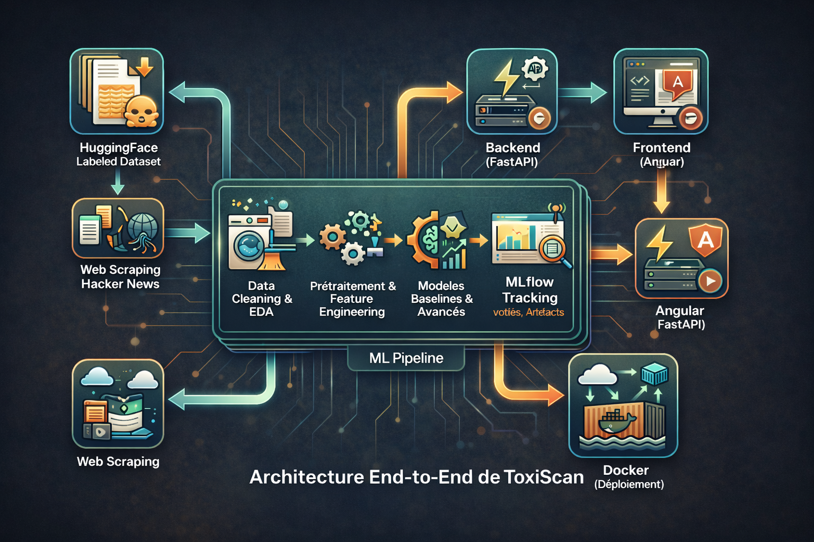
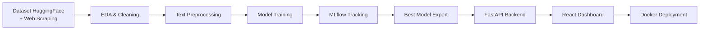

# ToxiScan — Plateforme End-to-End de Détection de Contenus Toxiques

**Module :** Python for Data Science 2 (Guided Machine Learning Project)  
**Encadrant :** Haythem Ghazouani  
**Année universitaire :** 2025–2026  
**Durée du projet :** 7 semaines  

---

## Présentation du projet

**ToxiScan** est une plateforme **Machine Learning end-to-end** conçue pour détecter automatiquement la **toxicité dans les commentaires en ligne**.

Le projet couvre **tout le cycle de vie d'un modèle de Data Science** :

- Collecte des données
- Analyse exploratoire (EDA)
- Prétraitement NLP
- Entraînement et comparaison de modèles
- Suivi des expériences (MLflow)
- Déploiement via **FastAPI**
- Interface utilisateur **React**
- Containerisation avec **Docker**

L'objectif est de proposer un système capable d'identifier automatiquement les commentaires toxiques afin d'aider les plateformes numériques dans la **modération de contenu**.

---

## Équipe (Groupe de 4)

| Membre | Rôle |
|---|---|
| **Nour BEN HASSINE** | Acquisition des données (dataset + web scraping) & EDA |
| **Nouha BEN KHELIL** | Prétraitement des données textuelles & Feature Engineering |
| **Hadir FELLI** | Modélisation, comparaison des modèles, ensembling & MLflow |
| **Nouha BRIKI** | Backend FastAPI, Frontend React & Docker |

📧 Mail de groupe : **nhningjg@gmail.com**

---

## Contexte & Problématique

Avec l'essor des réseaux sociaux et des plateformes numériques, les **contenus toxiques** (insultes, menaces, discours haineux) sont devenus un problème majeur.

La modération manuelle présente plusieurs limites :

- Lente et coûteuse
- Difficile à généraliser à grande échelle
- Sujette à des biais humains

L'objectif de **ToxiScan** est de développer un système capable de **détecter automatiquement la toxicité dans des commentaires textuels** grâce aux techniques de **Machine Learning appliquées au NLP**.

---

## Objectifs du projet

1. Sélectionner un **dataset textuel réel de grande taille**
2. Collecter des données réelles supplémentaires via **web scraping**
3. Réaliser une **analyse exploratoire des données (EDA)**
4. Mettre en place un **pipeline de prétraitement NLP**
5. Entraîner et comparer plusieurs **modèles de Machine Learning**
6. Améliorer les performances via **ensembling**
7. Suivre les expérimentations avec **MLflow**
8. Exporter le meilleur modèle
9. Déployer le modèle via **FastAPI**
10. Construire un **dashboard React interactif**
11. Containeriser l'application avec **Docker**
12. Démontrer un pipeline complet **Machine Learning → Application Web**

---

## Dataset principal

**Jigsaw Toxic Comment Classification**  
Source : [HuggingFace](https://huggingface.co/datasets/thesofakillers/jigsaw-toxic-comment-classification-challenge)

Le dataset contient environ **466 000 commentaires annotés** en classification **multi-label** :

| Label | Description |
|---|---|
| `toxic` | Commentaire globalement toxique |
| `severe_toxic` | Toxicité sévère |
| `obscene` | Contenu obscène |
| `threat` | Menace explicite |
| `insult` | Insulte directe |
| `identity_hate` | Haine identitaire |

**Pourquoi ce dataset ?**
- Données réelles de grande volumétrie
- Problème réel de modération de contenu
- Adapté au **multi-label classification**

---

## Web Scraping (Complément de données réelles)

Pour simuler un environnement réel, nous avons collecté des commentaires depuis **Hacker News** — [news.ycombinator.com](https://news.ycombinator.com).

### Scraping via API
```
code/scraping/hn_api_collect.py
```
- Récupération des IDs des commentaires
- Extraction du texte via l'API officielle HN
- Stockage en CSV

### Scraping HTML
```
code/scraping/hn_html_scrape.py
```
- Parsing HTML avec `requests` + `BeautifulSoup`
- Extraction de texte non structuré
- Simulation de données réelles de commentaires

---

## Architecture du projet


```mermaid
flowchart LR
    A[Dataset HuggingFace\n+ Web Scraping]
    --> B[EDA & Cleaning]
    --> C[Text Preprocessing]
    --> D[Model Training]
    --> E[MLflow Tracking]
    --> F[Best Model Export]
    --> G[FastAPI Backend]
    --> H[React Dashboard]
    --> I[Docker Deployment]
```

---

## Modélisation Machine Learning

### Modèle baseline
**TF-IDF + Logistic Regression (OneVsRest)**
- `class_weight="balanced"` pour gérer le déséquilibre des classes
- Optimisation via `GridSearchCV`

### Modèles avancés comparés
- Random Forest
- XGBoost

Tous les modèles ont été comparés et tracés avec **MLflow**.

---

## Tracking des expériences (MLflow)

MLflow a été utilisé pour :
- Suivre les hyperparamètres de chaque run
- Comparer les métriques (F1, Precision, Recall)
- Sauvegarder et versionner les modèles

**Meilleur modèle retenu :**  
`TF-IDF + OneVsRest Logistic Regression`  
Sauvegardé dans : `models/best_multilabel_tfidf_logreg.joblib`

---

## Backend — FastAPI

### Lancer l'API

```bash
uvicorn code.app:app --reload
```

**Swagger UI :** [http://localhost:8000/docs](http://localhost:8000/docs)

### Endpoints

| Méthode | Endpoint | Description |
|---|---|---|
| `GET` | `/health` | Vérifie que le modèle est chargé |
| `POST` | `/predict` | Analyse un commentaire unique |
| `POST` | `/predict_batch` | Analyse un fichier CSV complet |
| `POST` | `/predict_url` | Scrape et analyse une page web |

### Paramètres de `/predict_url`

```json
{
  "url": "https://example.com/article",
  "threshold": 0.35,
  "max_texts": 50
}
```

| Paramètre | Description |
|---|---|
| `url` | URL de la page à analyser |
| `threshold` | Seuil de décision (0.1 = sensible → 0.9 = strict) |
| `max_texts` | Nombre maximum de textes analysés |

---

## Frontend Dashboard

Interface développée avec **React + Vite**, thème sombre technique.

### Fonctionnalités

**Tab — Analyse texte**
- Saisie d'un commentaire
- Score de toxicité global
- Niveau de risque (Low / Moderate / High / Very High)
- Détail des 6 labels avec barres de probabilité
- Recommandations d'action

**Tab — Analyse CSV (Batch)**
- Upload d'un fichier `.csv` par drag & drop
- Colonnes attendues : `text` ou `comment_text`
- Statistiques globales : total, toxiques, taux, clean
- Résultats détaillés par ligne

**Tab — Analyse URL**
- Saisie d'une URL (page web publique ou locale)
- Scraping automatique du contenu
- Taux de toxicité global
- Breakdown par label avec barres de progression
- Liste des commentaires toxiques avec badges de labels

---

## Déploiement avec Docker

Le projet est entièrement containerisé avec **Docker Compose**.

### Lancer l'application

```bash
docker compose up --build
```

### Accès

| Service | URL |
|---|---|
| Frontend React | [http://localhost:3000](http://localhost:3000) |
| Backend FastAPI (Swagger) | [http://localhost:8000/docs](http://localhost:8000/docs) |

### Tester avec la page démo locale

```bash
# Dans un terminal séparé
cd /chemin/vers/demo_toxic_page.html
python -m http.server 9000
```

Puis dans le dashboard, onglet **URL** :
```
http://localhost:9000/demo_toxic_page.html
```

---

## Structure du repository

```
ToxiScan/
│
├── README.md
├── requirements.txt
├── docker-compose.yml
│
├── code/
│   ├── scraping/
│   │   ├── hn_api_collect.py
│   │   └── hn_html_scrape.py
│   ├── eda/
│   ├── ml/
│   └── app.py                  ← FastAPI backend
│
├── data/                       ← Datasets CSV
│
├── models/
│   └── best_multilabel_tfidf_logreg.joblib
│
├── frontend/                   ← React + Vite
│   └── src/
│       ├── App.jsx
│       ├── App.css
│       ├── api.js
│       └── components/
│           ├── ChurnForm.jsx
│           ├── BatchUpload.jsx
│           ├── URLAnalyzer.jsx
│           └── ResultsDisplay.jsx
│
├── mlruns/                     ← MLflow experiments
│
└── reports/                    ← Analyses et visualisations
```

---

## Stack technique

| Catégorie | Technologies |
|---|---|
| **Machine Learning** | Python, Scikit-learn, Pandas, NumPy |
| **NLP** | TF-IDF, Tokenization, Text cleaning |
| **Backend** | FastAPI, Uvicorn, BeautifulSoup |
| **Frontend** | React, Vite, Axios |
| **MLOps** | MLflow |
| **Deployment** | Docker, Docker Compose |

---

## Conclusion

**ToxiScan** est un projet complet de Machine Learning appliqué au NLP, couvrant l'ensemble du pipeline :

```
Data Collection
  → EDA & Preprocessing
    → Model Training & Comparison
      → MLflow Tracking
        → FastAPI Backend
          → React Dashboard
            → Docker Deployment
```

Le système démontre comment intégrer **Machine Learning**, **MLOps** et **développement web** dans une application fonctionnelle de détection automatique de toxicité — prête à être déployée en production.
